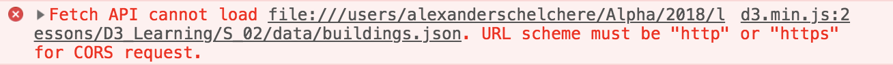

Here's My Readme. I'm going to try this again.

I'm learning how to use D3.js. Started in [_this repository_](https://github.com/Lexscher/learning-D3), however, I've been running into a problem when it comes to fetching the json in my data folder.

I would get this message in my console:

I'm starting anew because I read that it would be better if I had this running on a server instead of just opening the file, because my browser won't allow me to fetch those files for security reasons.

---

###### Thank you for taking an interest in my code.

#### Best,

## Alexander
